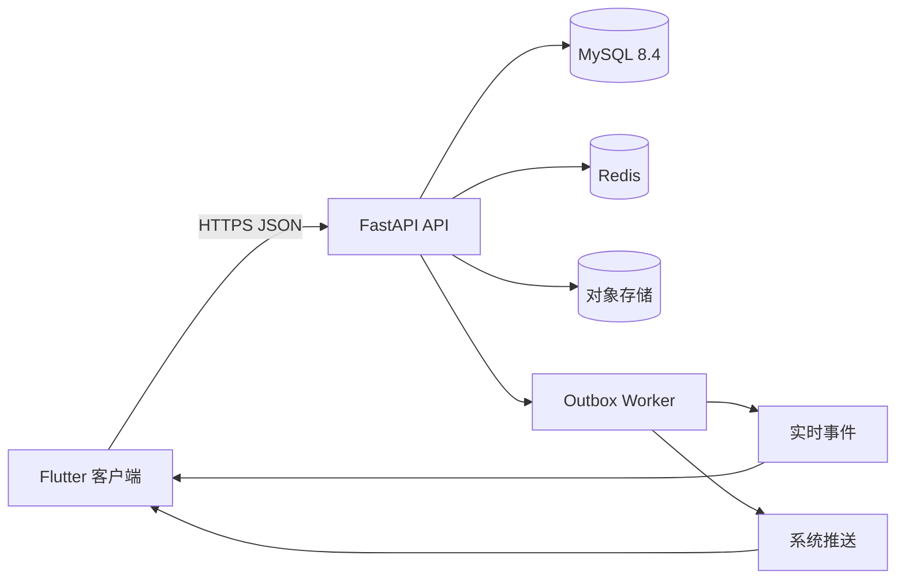
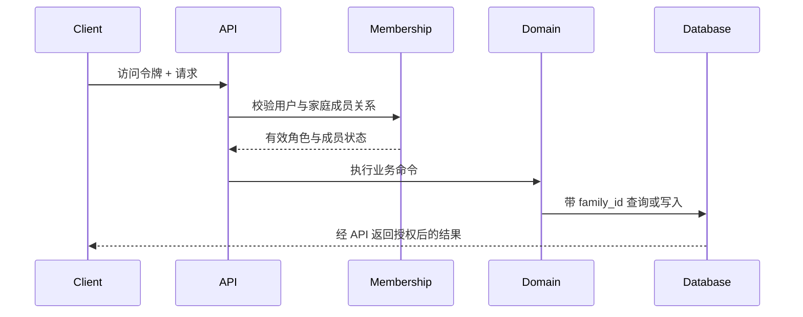

# 系统架构

## 总体结构

客户端与后端拥有独立依赖、构建产物和测试。`compose.yaml` 只负责开发环境编排，不改变两端的源码边界。

## 后端模块边界

首版使用模块化单体：

| 模块 | 职责 |
| --- | --- |
| accounts | 独立微信/QQ 账号、会话、个人资料与注销 |
| families | 家庭空间、邀请、成员关系和角色 |
| logs | 日志、附件和发布状态 |
| notices | 家庭注意事项 |
| countdowns | 倒计时、纪念日、重复规则和提醒 |
| interactions | 评论、回复和点赞 |
| notifications | 站内通知、已读状态和推送任务 |
| media | 签名上传、图片校验、转码和对象权限 |

模块共享同一个数据库实例，但表归属和业务写入口必须明确。禁止通过跨模块随意修改表来绕过领域规则。

## 账号身份边界

微信和 QQ 不是同一用户的可替换登录方式。每次首次授权按照第三方平台及稳定身份标识创建独立用户：

- `login_identities(provider, provider_subject)` 唯一，防止同一第三方身份产生多个用户；
- `login_identities(user_id)` 唯一，防止一个用户增加第二个登录身份；
- 不提供手机号身份，也不提供绑定、换绑、解绑、迁移或合并流程；
- 用户改用另一个平台登录时会进入另一套独立的家庭关系、内容、通知和个人资料。

同一平台的移动端和桌面端可以在获得可信稳定标识时登录同一个用户；不得用昵称、头像或其他可变资料推断身份。

## 家庭数据边界

每个家庭业务资源都携带 `family_id`。请求处理顺序为：

不得仅依赖客户端提交的 `family_id`。成员退出或被移除后，其访问令牌即使尚未过期，也必须在下一次家庭资源请求时被拒绝。

## 数据一致性

核心业务数据和 Outbox 事件在同一 MySQL 事务内提交。Worker 以事件 ID 幂等消费，负责站内通知、SSE 事件和系统推送。MySQL ROW binlog 用于恢复和 CDC 基础设施，不作为面向客户端的同步协议。

## 客户端结构

客户端按功能垂直切分，每个功能可包含：

- `data/`：API DTO、数据源和仓储实现；
- `domain/`：实体、值对象、仓储接口和用例；
- `presentation/`：状态、页面和组件。

平台特有能力通过明确的适配器接入。WidgetKit、Android App Widgets、推送和三方登录允许包含原生代码，但业务规则留在可测试的 Dart 层或后端。

## 演进原则

- 先在模块化单体中建立清晰边界，只有出现独立扩缩容或团队隔离需求时才拆服务；
- API 兼容当前及前一个主要客户端版本；
- 数据库变更采用扩展、迁移、收缩的分阶段策略；
- 实时事件只提示增量或失效，HTTPS API 始终是数据事实来源；
- “仅自己”可见性只做模型预留，未正式启用前不能通过公共 API 写入。
